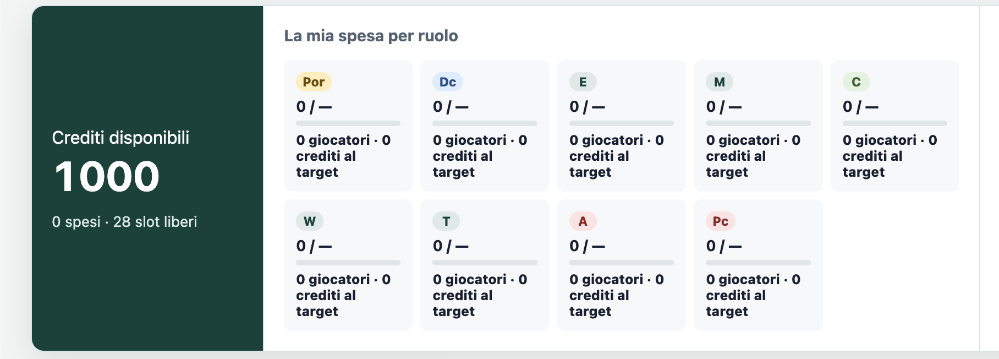
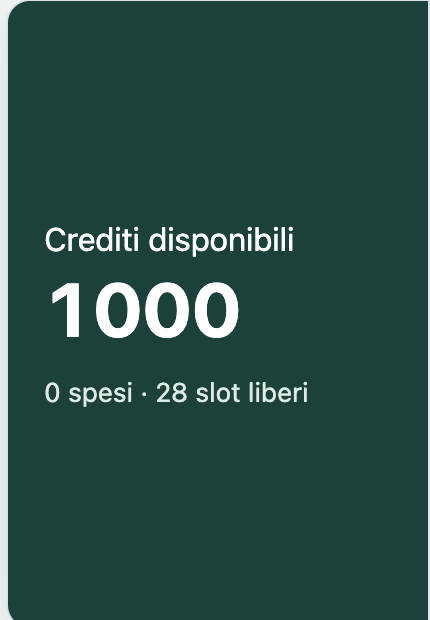
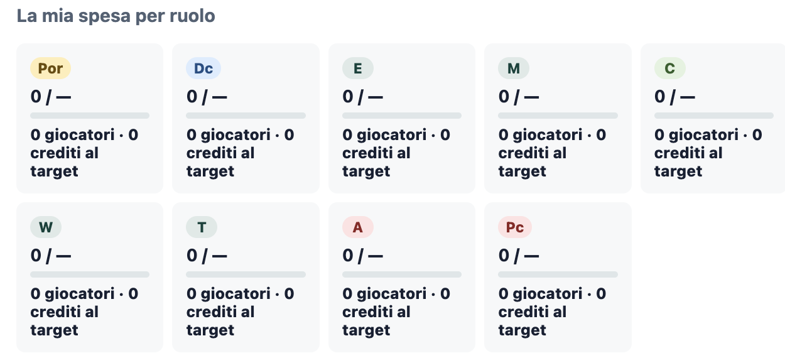

# ⚽ Fantasy Football Auction Tool

### Keep your auction under control. One credit at a time.

A local web app for quickly managing a **Mantra or Classic** auction: search for players, record purchases, and monitor budgets, squads, and strategy from a single dashboard.

[Italian version](README.md.ita)



## Why use it

- **Fast auctions** — search, filter by role, and assign players instantly.
- **Mantra and Classic** — roles, squads, and constraints tailored to each mode.
- **Visual budgets** — green, yellow, or red cards based on the configured maximums.
- **Personal strategy** — budgets by role and target players organized into tiers.
- **Always up-to-date squads** — credits, slots, and purchases for every team.
- **Local-first** — no account required: data stays in the browser and can be exported.

## Designed for live auctions

<table>
  <tr>
    <td width="34%" valign="top">
      
      <br><strong>Everything at a glance.</strong><br>
      Credits, spending, and open slots remain visible throughout the auction.
    </td>
    <td width="66%" valign="top">
      
      <br><strong>Every department under control.</strong><br>
      The dashboard compares spending against the configured maximums and counts purchases by role.
    </td>
  </tr>
</table>

## Quick start

No dependencies are required. From the project directory, run:

```bash
python3 -m http.server 8080
```

Open [http://localhost:8080](http://localhost:8080) and choose a game mode.

> Do not open `index.html` directly: the browser may block the JSON catalogues from loading.

## Modes

| Mantra | Classic |
| --- | --- |
| Configurable real roles | Fixed quotas: `3P · 8D · 8C · 6A` |
| Default: 10 teams, 1,000 credits | Default: 8 teams, 500 credits |
| Customizable squad and budget | Fixed 25-player squad |

## Backups and tests

Changes are saved automatically in the browser. Use **Export backup** to safeguard your auction and **Import backup** to resume it in another browser.

```bash
npm test
```

The initial catalogues are stored in `src/players.json` and `src/players-classic.json`. You can also edit them from the app's **Catalogue** section.
